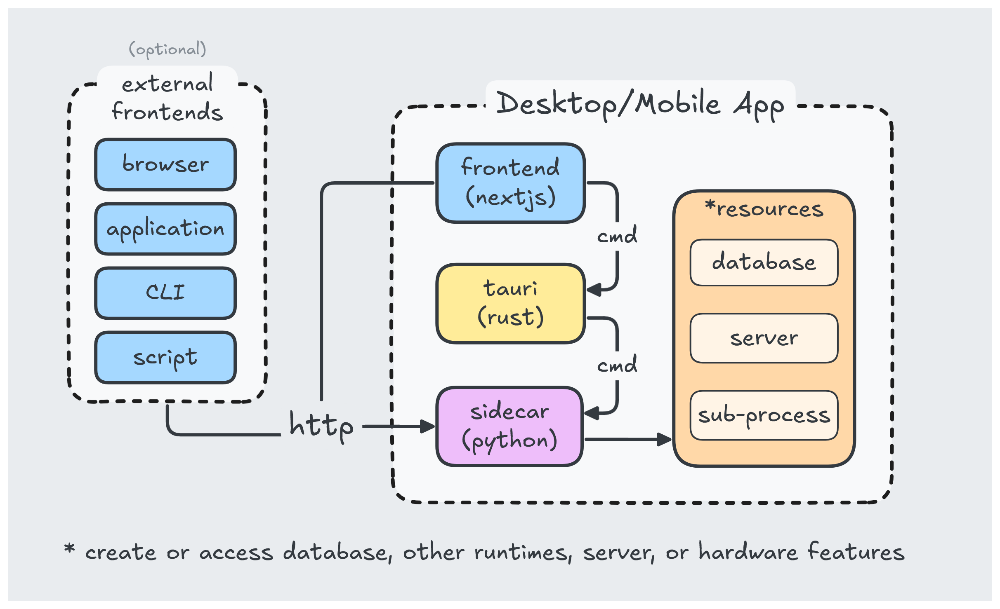

# Example Tauri v1 app using Python sidecar

A native app built with Tauri v1 that spawns a Python sub-process (sidecar) which starts a FastAPI server.


<br>


> [!IMPORTANT]
>
> <h2>🚨 Attention 🚨</h2>
> <h3>Tauri v2 example is now available:
> <a href="https://github.com/dieharders/example-tauri-v2-python-server-sidecar" style="color: #228be6">example-tauri-v2-python-server-sidecar</a></h3>
> <h4>More features, build scripts, examples and documentation.</h4>

<!-- <h2 align="center" style="padding: 0.5rem; margin-bottom: 1rem; font-weight: bold; background-color: #fab005; color: black; width: 100%; height: auto; text-align: center;">👀 🚨 Attention 🚨 👀<br/>Tauri v2 example is now available:<br/><a href="https://github.com/dieharders/example-tauri-v2-python-server-sidecar" style="color: #228be6">example-tauri-v2-python-server-sidecar</a>
<p style="font-weight: normal">More features, build scripts, examples and documentation.</p></h2> -->


## Introduction

This example app uses Next.js as the frontend and Python (FastAPI) as the backend. Tauri is a Rust framework that orchestrates the frontend and backend(s) into a native app experience.

## How It Works



Tauri takes your frontend UI written in html/javascript and displays it in a native webview. This makes the resulting file size smaller since it does not need to include a web browser.

## Getting Started

### Dependencies

Install dependencies for javascript:

```bash
pnpm install
```

To install python dependencies listed in requirements.txt:

```bash
pnpm dev-reqs
```

In case you dont have PyInstaller installed:

```bash
pip install -U pyinstaller
```

### Run

To run the app in development mode with hot-reload (js):

```bash
pnpm tauri dev
```

### Build

#### Compile python sidecar

Run this at least once before running `pnpm tauri dev` and each time you make changes to your python code. This command is also called by `pnpm tauri build`:

```bash
pnpm build:fastapi
```

#### Build app for production:

```
pnpm tauri build
```

This creates an installer located here:

- \<project-dir>\src-tauri\target\release\bundle\nsis

## Learn More

- [Tauri Framework](https://tauri.app/) - learn about native app development in javascript and rust.
- [NextJS](https://nextjs.org/docs) - learn about the popular react framework Next.js
- [FastAPI](https://fastapi.tiangolo.com/) - learn about FastAPI server features and API.
- [PyInstaller](https://pyinstaller.org/en/stable/) - learn about packaging python code.
